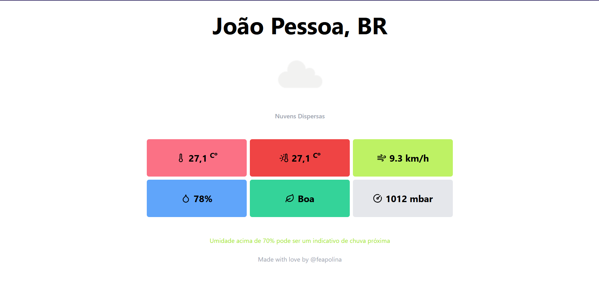

---

# Jampa Weather 🌤️  
  

O **Jampa Weather** é um aplicativo que fornece informações meteorológicas precisas para a cidade de João Pessoa, para que você possa planejar melhor o seu dia e acompanhar o clima em tempo real!  

## 🚀 Recursos Principais  
- Exibição de informações meteorológicas atualizadas.  
- Interface intuitiva e responsiva.  

## 🖥️ Acesse o Projeto  
Você pode acessar o projeto online clicando [aqui](https://feapolina.github.io/jampa-weather/).  

## 🛠️ Tecnologias Utilizadas  

### Frontend  
- **ReactJS**  
- **TailwindCSS**  

### Backend  
- **TypeScript**  

## 📂 Executar Localmente  

Clone o repositório:  

```bash  
git clone https://github.com/feapolina/jampa-weather.git  
```  

Navegue até o diretório do projeto:  

```bash  
cd jampa-weather  
```  

Instale as dependências:  

```bash  
npm install  
```  

Inicie o servidor local:  

```bash  
npm run dev  
```  

Abra [http://localhost:5173](http://localhost:5173) no navegador para visualizar o projeto.  

## 👨‍💻 Autor  

- [@feapolina](https://github.com/feapolina)  

## 💡 Feedback  
Se tiver algum feedback ou sugestão, entre em contato:  
📧 **fe.cavalcanti2016@gmail.com**  

---  
